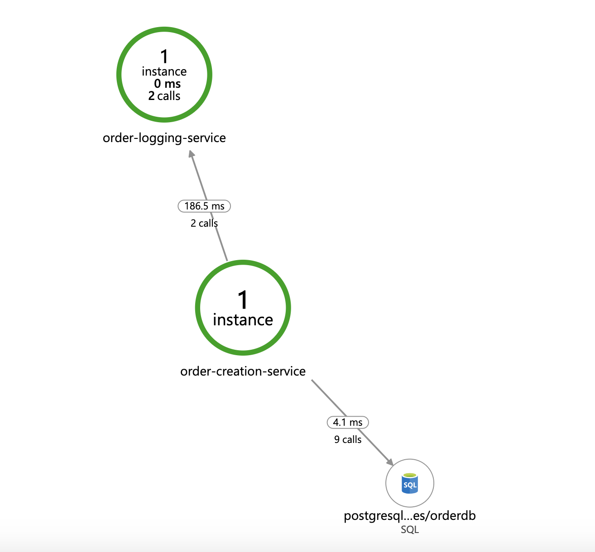

# Order Management 
This repository demonstrates Observability in springboot microservices using Azure Application Insights Java SDK.

## Core Components
- Order Creation Microservice (Producer Service)- Springboot microservice responsible for creating new orders and 
pushing events to RabbitMQ.
- Postgres SQL for persistence.
- Rabbit MQ - Message Broker to enable asynchronous communication.
- Order Logging Service (consumer service) - Springboot microservice which reacts on the events published by Order creation
service and logs the information to console. 

### [Enable Azure Application Insights](https://docs.microsoft.com/en-us/azure/azure-monitor/app/app-insights-overview):
- Create an application insights resource and obtain the instrumentation key. You can follow [this](https://docs.microsoft.com/en-us/azure/azure-monitor/app/app-insights-overview)
tutorial for details.
- modify the application.properties for OrderCreationService and OrderLoggingService and add update the property
`azure.application-insights.instrumentation-key=<your-ikey>` with your instrumentation key.

### Build the services

`mvnw clean build`

This command will build all the microservices.

### Deploy on docker

Prerequisites: 

- Make sure you have docker installed and running locally. You can install docker by following the steps on docker's official
website.

run the command `docker-compose up`. This will deploy all the microservices including RabbitMQ message broker on a common
docker network.

### Post requests 

`curl -d '{"orderNumber" : "abc123", "productId" : "xyz123"}' -H "Content-Type: application/json" -X POST http://localhost:18080/orders`

This would create a new order message and publish it to RabbitMQ. The consumer service reacts on this message, and
logs the information on console. 

### End To End Transaction on Azure Application Insights

### Application Map View

### Visualize RabbitMQ Metrics on Azure Metrics Explorer

